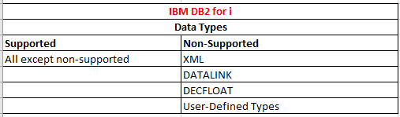
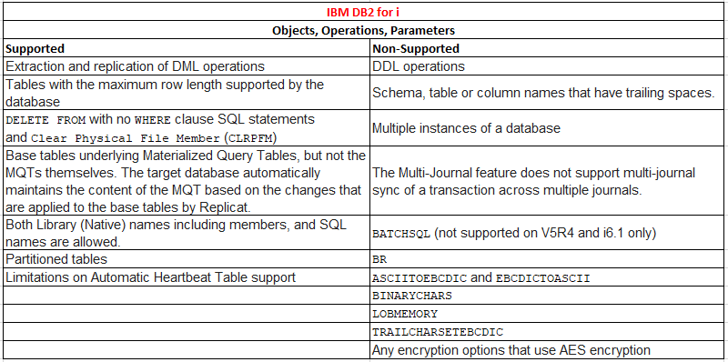

Created by: J.Murray\
Date: 1st July 2020
1. - [x] Firewalls configured in Azure 
2. - [x] VMs in Azure with access to OCI and DB2/AS400 (DONE)
3. **CDC Options**
   1. - [X] Syniti
   2. - [X] Talend Data Integration
   3. - [x] GoldenGate
   4. - [ ] Streamsets (Opensource)
# Requirements for DB2 for i
# GoldenGate
## Instructions for **IBM-DB2** for i source
Link: https://docs.oracle.com/goldengate/c1230/gg-winux/GGHDB/using-oracle-goldengate-db2-i.htm#GGHDB-GUID-F382412C-640E-473F-8223-37B0A7AB04C6

With Oracle GoldenGate for DB2 for i, you can:

* Map, filter, and transform transactional data changes between similar or dissimilar supported DB2 for i versions, and between supported DB2 for i versions and other supported types of databases.

* Perform initial loads from DB2 for i to target tables in DB2 for i or other databases to instantiate a synchronized replication environment.

## Support List Matrix for DB2 for i
### Data Types

### Objects, OPerations and Parameters

## Preparing the System for Oracle GoldenGate
Summary list of Item requiring access:
1. **Journals Enabled** for Data Capture by Extract
   1. **Allocating** Journals to an **Extract Group**
   2. Setting **Journal Parameters**
   3. **Deleting** Old Journal Receivers   
2. Specifying **Object Names**
   1. Assigning Row Identifiers
   2. Preventing Key Changes
   3. Disabling Constraints on the Target
   4. Enabling Change Capture
   5. Maintaining Materialized Query Tables
   6. Specifying the Oracle GoldenGate Library
3. Adjusting System Clock
4. Configuring the ODBC Driver

# Syniti
When setting up IBM DB2 for i for use with Syniti Data Replication:

1. **Set user ID authorities** appropriately (DBMS tools)
2. Make sure tables are **journaled** and **receivers** are set up appropriately (DBMS tools)
3. **Create a library** on Db2 (Management Center)
   
When replicating from IBM Db2 for i using mirroring or synchronization, three transactional modes are available: 
1. Log Reader
2. Log Server Agent
3. Log Reader API
   > **Note**: The Log Reader API is required when replicating tables with LOB values. Log Reader API option is available for Db2 for i V6R1 and above.

For all three modes, you first need to:
### **Setting up user with authorities**
Your user ID needs the authority to run the following commands:

* DSPOBJD on the schema used for replication

and to access the following system tables:

* QSYS2.SYSTABLES
* QSYS2.SYSCOLUMNS
* QSYS2.SYSCST
* QSYS2.SYSKEYCST
* QSYS2.SYSKEYS
* QSYS2.SYSINDEXES
* QSYS2.SYSPARTITIONSTAT
* SYSIBM.SQLFOREIGNKEYS*

Additionally, only if the system is used as source in mirroring or synchronization mode, the user ID needs access to:

* DSPJRN (on the journals/receivers involved in replication)
* DSPFD (on the tables involved in replication)
* DSPFFD (on the tables involved in replication)

For synchronization, the user ID should be used exclusively for Syniti Data Replication so that transactions executed by Syniti DR can be easily identified in the journal.

### **CREATING THE LIBRARY on DB2 for i**
**Set up a library on your Db2 system**. This step sets up the library by `transferring` a `savf` file (via `FTP`) to the Db2 server and creating the DBMOTOLIB library (or a library name of your choosing). You can also perform this procedure *manually* for more complete control over operations or in case the automatic process does not work.
* **The library name**
  * DBMOTOLIB, is supplied. This field can be modified to supply a different library name. This is the name of the library that will be created on the Db2 system. It can be useful to change the default library name when, for example, you have two CDC installations using the same database server, and you wish to keep separate libraries for each installation.
* **Savf File**
  * In iSeries(AS400) Save files are very handy in saving objects, complete libraries, IFS directories and files and then restoring them back on the same or different machine. You can even save a save file inside another save file.
* **FTP access**
  * A user ID with write permissions and QSECOFR privileges on the Db2 server

## Synchronization Limitation with IBM Db2 for i
If you are planning a synchronization replication with IBM Db2 for i (iSeries/AS400) as a source or target database, note that any CLRPFM commands which Syniti Data Replication encounters in the journal will not be propagated to the destination table. Synchronization does not support the use of clear on physical members, although clear commands are supported for mirroring replications.

To work around this restriction, avoid calling the CLRPFM command, replacing it with DELETE FROM TABLE without adding a WHERE condition.

# Talend ESB Studio
Prior to setting up CDC in Redo/Archive log mode (journal) on AS/400, you need to verify the prerequisites as follows on your AS/400:

the AS/400 user account for CDC must have *ALLOBJ privileges or at least all of the following **privileges**:

- CRTSAVF
- CLRSAVF
- DLTF
- RSTLIB
- DLTLIB
- CRTLIB
- CHGCMD
- FTP (access to the FTP port must be ensured),
- READ access on journal receivers
- READ access on monitored AS/400 files
- READ/WRITE access on output library

**File names:**
* The names of the files of interest should not exceed 10 characters;

* If the files of interest are already journalized, the journal must be created with option IMAGES (*BOTH)
